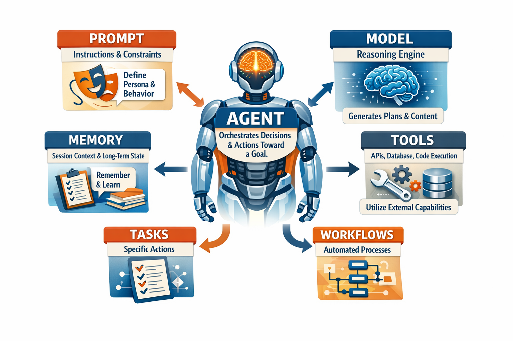

# Awesome AI Agent Development

A compact guide to core agent-building concepts.

## Core Components
- **Agent**: Orchestrates decisions and actions toward a goal.
- **Model**: Reasoning engine that generates plans/content.
- **Prompt**: Instructions that define behavior and constraints.
- **Memory**: Session context and long-term state.
- **Tools**: External capabilities (APIs, DB, filesystem, code execution).

## Execution Building Blocks
- **Trigger**: Event that starts execution (user action, schedule, webhook).
- **Task**: A single unit of work (e.g., summarize, classify, send email).
- **Workflow**: Ordered tasks + logic (branching, retries, handoffs).

## Relationship (Quick View)
- `Trigger -> Workflow -> Tasks`
- Agent runs the workflow.
- Model reasons.
- Prompt steers output.
- Memory preserves context.
- Tools perform real actions.

## Development
Development is about choosing the right level of automation and control for your team and use case.

### Code
Best when you need custom logic, deep integrations, version control, testing, and scalable architecture.

### Node-Code
Best when you want fast workflow building using visual nodes and low-complexity automation without heavy engineering overhead.

## Agent Development Frameworks and Tools
This ecosystem spans two common approaches: code-first frameworks for custom agent engineering, and workflow/no-code platforms for fast automation delivery.

### Quick Comparison
| Tool | Style | Languages / Runtime | Best For | Tradeoff |
| --- | --- | --- | --- | --- |
| [Symfony AI](https://symfony.com/doc/current/ai) | Code-first framework | PHP / Symfony | Teams already on Symfony that want unified provider + agent components | Best experience is inside Symfony architecture |
| [Laravel AI SDK](https://laravel.com/docs/13.x/ai-sdk) | Code-first SDK | PHP / Laravel | Laravel apps needing agent classes + broad provider support | Tightest fit inside Laravel conventions |
| [Mastra](https://mastra.ai/) | Code-first framework | TypeScript | Product teams shipping TS agents with workflows, memory, MCP, observability | Requires TS engineering ownership |
| [VoltAgent](https://voltagent.dev/) | Code-first + platform | TypeScript | Teams wanting TS framework plus optional ops console (evals/monitoring/deploy) | More moving parts if you adopt full platform |
| [CrewAI](https://crewai.com/) | Multi-agent platform | Python ecosystem + platform tooling | Role-based multi-agent orchestration with business tool integrations | Platform-first approach may add vendor workflow dependencies |
| [Microsoft Agent Framework](https://github.com/microsoft/agent-framework) | Code-first framework | Python + .NET | Enterprises standardizing on Microsoft stack and multi-agent orchestration | Newer framework surface; expect active evolution |
| [n8n](https://n8n.io/) | Visual workflow platform | Node-based visual builder + code hooks | Fast automation and agent workflows with strong integrations | Complex logic can become harder to manage visually |
| [Make](https://www.make.com/) | Visual automation platform | No-code/low-code builder | Teams building integrations and automations quickly with visual scenarios | Large, branching flows can become hard to govern |
| [Zapier](https://zapier.com/) | Automation platform | No-code builder + app integrations | Fast business workflow automation across SaaS tools | Advanced custom logic may require workarounds or code steps |
| [ADK](https://adk.dev/) | Code-first framework | Python, TypeScript, Go, Java | Polyglot teams needing open-source framework + enterprise-scale deployment path | Broader scope means steeper adoption choices |
| [Pydantic AI](https://pydantic.dev/docs/ai/overview/) | Code-first framework | Python | Python teams prioritizing typed, validated agent outputs and production workflows | Primarily Python-centric |

### Practical Selection Guide
- Pick **Symfony AI** or **Laravel AI SDK** if your app is already in that PHP framework.
- Pick **Mastra** or **VoltAgent** if your product stack is TypeScript-first.
- Pick **Pydantic AI** or **CrewAI** for Python-heavy agent systems.
- Pick **Microsoft Agent Framework** for Python/.NET multi-agent systems in Microsoft-centric environments.
- Pick **n8n** when speed, visual orchestration, and integrations matter more than deep custom architecture.
- Pick **Make** or **Zapier** for fast no-code SaaS automation and business workflows.
- Pick **ADK** when you need one agent framework strategy across multiple languages.

## Definition of Terms
| Term | Meaning |
| --- | --- |
| MCP | **Model Context Protocol**. A standard way for models/agents to connect to external tools and data sources through MCP servers. |
| ACP | **Agent Communication Protocol** (term usage varies). A protocol idea for structured agent-to-agent messaging and coordination. |
| Agent Skills | Reusable capability packages for agents (instructions, tools, workflows, constraints) that can be invoked on demand. |
| RAG | **Retrieval-Augmented Generation**. Pull relevant documents at runtime and use them in prompts before generation. |
| Embeddings | Numeric vector representations of text/code used for similarity search and semantic retrieval. |
| Vector Database | Storage optimized for embedding search (nearest-neighbor queries) used in RAG pipelines. |
| Tool Calling / Function Calling | Letting a model choose and call defined tools/APIs with structured inputs. |
| Orchestration | Managing execution order, retries, state, and handoffs across tools, tasks, and agents. |
| Guardrails | Controls that constrain outputs/actions (policy checks, schema validation, safety filters). |
| Evals | Systematic tests/benchmarks for quality, reliability, and regression detection in AI features. |
| Observability / Tracing | Logging model/tool calls, latency, cost, and execution paths for debugging and monitoring. |
| Context Window | Maximum input/output token capacity a model can process in one request. |
| System Prompt | High-priority instruction defining model role, constraints, and behavior defaults. |
| Prompt Template | Structured prompt pattern with placeholders to keep outputs consistent across runs. |
| Model Routing | Selecting different models by task (quality, speed, cost, modality, policy). |
| HITL | **Human-in-the-Loop** review or approval checkpoints before sensitive actions are executed. |
| Multi-Agent | Pattern where specialized agents collaborate, delegate, and exchange state/messages. |
| Workflow Engine | Runtime that executes graph/step logic, scheduling, branching, retries, and state persistence. |
| Grounding | Anchoring outputs to trusted sources/data to reduce hallucinations and improve factuality. |
| Idempotency | Designing actions so retries do not create duplicate side effects (e.g., duplicate emails/charges). |

## FAQs
### Do we need to train AI models when building an agent?
Usually, no. Most agent systems are built with existing foundation models plus strong prompting, tool use, retrieval (RAG), and workflow design. Consider fine-tuning only when repeated evals show prompt/tool improvements are not enough for your quality, cost, or latency goals.

### What is the difference between an AI chatbot and an AI agent?
A chatbot mainly answers questions. An AI agent can also take actions, use tools, follow workflows, and complete multi-step tasks with less manual intervention.

### Do I need to know programming to start using AI agents?
Not always. No-code tools like n8n, Make, and Zapier can help you build useful automations. Programming becomes important when you need custom logic, advanced integrations, or stronger control.

### What are the easiest first use cases for beginners?
Good starting points are email drafting, document summarization, FAQ assistants, lead qualification, and simple workflow automations (for example, form submission -> CRM update -> email response).

### How much does it cost to run an AI agent?
Cost usually depends on model usage (tokens), number of executions, tool/API calls, and monitoring infrastructure. Start with small scoped workflows, add usage limits, and track cost per task early.

### How can I reduce wrong or hallucinated answers?
Use grounding with trusted data (RAG), strict output formats, validation checks, and human review for high-impact decisions. Measure quality with evals before broad rollout.

### What should we automate first, and what should stay human?
Automate high-volume, repeatable, low-risk tasks first. Keep human approval for legal, financial, medical, security, or customer-sensitive decisions.

### How long does it take to build a useful agent?
A simple internal workflow can be built in days. Production-grade agents with security, monitoring, evals, and integrations typically take weeks to a few months.

### How do we know if an AI agent project is successful?
Define clear metrics: time saved, error rate reduction, response quality, customer satisfaction, and cost per completed task. Review these metrics continuously after launch.

### How do we ensure data integrity and security during AI agent development and execution?
Use layered controls: least-privilege access, secret management, encryption in transit/at rest, strict input/output validation, idempotent tool actions, human approval for sensitive operations, audit logs/traces, and regular security testing. Treat agent actions like production API operations with clear policy enforcement and monitoring.

## Conclusion
Start simple, iterate quickly, and increase complexity only when your product requirements demand it.

