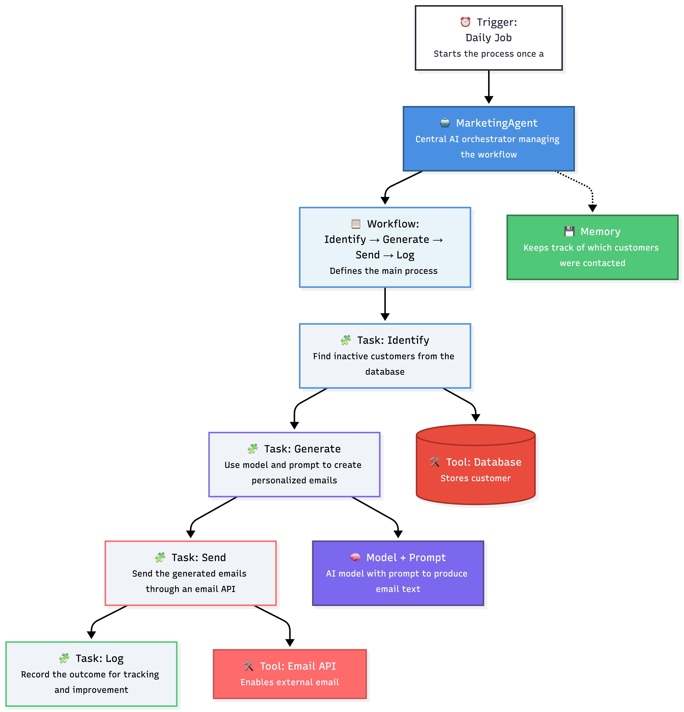

# Awesome AI Agent Development

A compact guide to core agent-building concepts.

## Core Components
- **Agent**: Orchestrates decisions and actions toward a goal.
- **Model**: Reasoning engine that generates plans/content.
- **Prompt**: Instructions that define behavior and constraints.
- **Memory**: Session context and long-term state.
- **Tools**: External capabilities (APIs, DB, filesystem, code execution).

## Execution Building Blocks
- **Trigger**: Event that starts execution (user action, schedule, webhook).
- **Task**: A single unit of work (e.g., summarize, classify, send email).
- **Workflow**: Ordered tasks + logic (branching, retries, handoffs).

## Relationship (Quick View)
- `Trigger -> Workflow -> Tasks`
- Agent runs the workflow.
- Model reasons.
- Prompt steers output.
- Memory preserves context.
- Tools perform real actions.

## Development
Development is about choosing the right level of automation and control for your team and use case.

### Code
Best when you need custom logic, deep integrations, version control, testing, and scalable architecture.

### Node-Code
Best when you want fast workflow building using visual nodes and low-complexity automation without heavy engineering overhead.

## Conclusion
Start simple, iterate quickly, and increase complexity only when your product requirements demand it.

